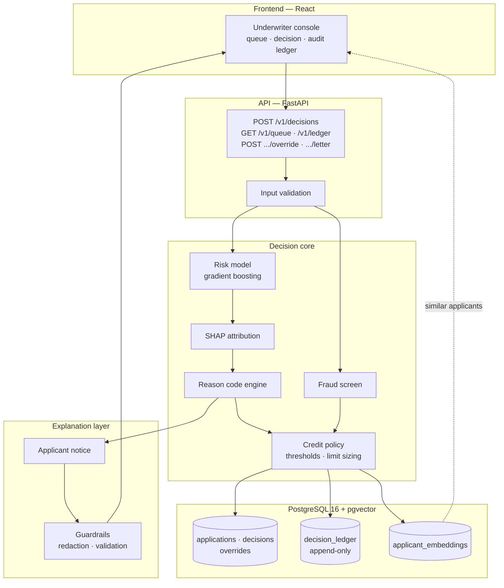

# Aperture

A credit underwriting system that approves more applicants with little or no
credit history, without increasing the lender's loss rate.

One Synchrony Hackathon 2026 — Problem Statement 1, Next-Gen Credit
Intelligence.

Gangapuram Aryan · SE23UARI038 · B.Tech AI, Mahindra University

---

## Getting started

Requires Python 3.11+, Node 18+, and Docker.

**1. Install**

```bash
python -m venv .venv && source .venv/bin/activate
pip install -r requirements.txt
cp .env.example .env
```

**2. Start the database**

```bash
docker compose up -d
docker compose ps          # wait until status is "healthy"
```

pgvector is enabled automatically on first boot by `scripts/init_db.sql`.
Postgres is published on port **5433** to avoid clashing with an existing local
install.

**3. Train the model**

Download [Home Credit Default Risk](https://www.kaggle.com/c/home-credit-default-risk/data)
from Kaggle into `data/home-credit/`, then:

```bash
python -m ml.train --data homecredit --path data/home-credit
```

Takes 3–6 minutes. Writes trained models and the results table to `artifacts/`.

Running `python -m ml.train` without arguments uses a synthetic data generator
instead. That exists so the pipeline can be built and tested without the 2.7 GB
download. Those figures are a smoke test and are not reported anywhere as
results.

**4. Run the application** — three terminals

```bash
uvicorn backend.main:app --reload --port 8000
cd frontend && npm install && npm run dev
python -m scripts.seed_queue --count 180
```

Console: http://localhost:5173
API documentation: http://localhost:8000/docs

**5. Run the tests**

```bash
python -m pytest
```

---

## Project structure

```
ml/
  features.py       feature groups, thin-file rule, excluded features
  synth.py          synthetic data generator (development only)
  homecredit.py     loads and aggregates the Home Credit tables
  train.py          trains the baseline and enhanced models
  evaluate.py       approval-rate-at-fixed-loss, AUC, fairness metrics
  reason_codes.py   SHAP attributions to adverse action reason codes
  embeddings.py     applicant feature vectors for similarity search

backend/
  config.py         settings loaded from environment
  database.py       tables, including the append-only decision ledger
  schemas.py        request and response validation
  scoring.py        model loading, credit policy, fraud screen
  precedents.py     pgvector similarity search
  llm.py            applicant notices, guardrails, template fallback
  main.py           FastAPI application

frontend/           React console
scripts/            queue seeding, database initialisation
tests/              16 tests
```

---

## What it does

An application arrives at `POST /v1/decisions`. The system returns a decision,
a credit limit, the principal reasons behind it, and a fraud verdict — in about
10 milliseconds.

Every decision is written to an append-only ledger. An underwriter can review
any decision in the console, see which factors drove it, compare it against
similar past applicants, generate the applicant's notice, and override the
outcome with a recorded justification.

### Results

I trained two models on 307,511 real loan applications. Same algorithm, same
hyperparameters, same random seed, same train/test split. The only difference is
that one model can also see behavioural data: instalment payment punctuality,
payment completeness, revolving balance trend, transaction frequency, and device
tenure.

Both were measured the same way — at a fixed 3% realised loss rate, what share of
applicants can be approved?

| Segment | Traditional data | + behavioural data | Gain |
|---|---:|---:|---:|
| **No credit history** | 35.25% | **40.09%** | **+4.84 pp** |
| Established credit history | 58.88% | 61.14% | +2.25 pp |
| All applicants | 52.50% | 54.87% | +2.37 pp |

AUC on the no-history segment improved from 0.746 to 0.760.

The comparison between the first two rows is the actual finding. Behavioural
data improved approvals for applicants with no credit history by more than twice
as much as for everyone else. If it had helped both segments equally, the likely
explanation would be that the baseline model was undertrained. A gain
concentrated where the credit file is empty indicates that real information was
previously being ignored.

Applicants with little or no credit history are 28.3% of the dataset — 87,161 of
307,511.

---

## Tech stack

| Layer | Specified | Used |
|---|---|---|
| Frontend | React JS | React 18 + Vite |
| Backend | Spring Boot or equivalent | FastAPI |
| Database | PostgreSQL | PostgreSQL 16 |
| Vector search | pgvector or equivalent | pgvector 0.8.6 |
| AI layer | AWS Bedrock or equivalent | provider-abstracted (Anthropic / OpenAI / Ollama) |
| Cloud | AWS or equivalent | Docker Compose |
| Security | Auth, validation, no hardcoded secrets | JWT, Pydantic, environment config |
| Model | — | scikit-learn gradient boosting, SHAP |

FastAPI is used in place of Spring Boot because the model, the SHAP explainer,
and the embedding code are all Python, and keeping inference in-process avoids a
cross-language network call on every decision. The API layer is thin and could
be ported to Spring Boot in roughly a day.

Configuration is read from `.env`, which is git-ignored. `.env.example` is
committed with placeholder values.

---

## Architecture



The model produces a probability of default. It does not produce the decision.
A separate policy layer converts that probability into approve, refer, or
decline using thresholds that a credit officer can change without retraining
anything.

The fraud screen runs independently and takes precedence: a blocked application
is declined regardless of its credit score, because that score was computed from
data that may not describe a real person.

---

## Explainability

A lender cannot decline an applicant without giving specific reasons. Under ECOA
and Regulation B in the US, and the RBI's digital lending guidelines in India,
the applicant is entitled to know what drove the decision.

The pipeline is deterministic:

```
features → model → SHAP attribution → ranked adverse factors → reason codes
```

SHAP gives the contribution of each feature for one specific applicant. The
factors that increased risk are ranked, the top four are taken, and each maps to
a fixed reason code with a plain-language statement and a suggested improvement.
The same input always produces the same reasons.

Reason codes are deduplicated. Several features map to the same disclosure —
the three external score columns all mean "external score is low" — so listing
it repeatedly would waste the four principal reason slots. Freed slots go to the
next distinct reason.

### Applicant notices

A language model can be configured to turn the reason codes into a readable
letter. It only phrases them; it cannot select reasons, alter the outcome, or
change the probability. Those are fixed before it runs.

This matters because a language model is not deterministic. If it selected the
reasons, the same applicant could receive two different explanations on two
different days, which cannot be audited.

Three controls:

- The applicant's name and identifiers are never sent to the provider. Only
  reason statements and, for an approval, the credit limit.
- Every number in the generated letter is checked against the decision record. A
  letter containing a figure that is not in the record is discarded, not
  displayed with a warning.
- If no provider is configured, or the call fails, or validation rejects the
  output, a deterministic template composes the letter from stored facts.

The system currently runs on the template path. The provider is a single setting
in `.env`.

---

## Fair lending

**Excluded features.** Gender, marital status, religion, caste, applicant
photograph, contact list size, and pin code are excluded from the model, each
with a recorded reason in `ml/features.py`. Pin code is excluded because
residential location frequently acts as a proxy for community or background,
allowing indirect discrimination without the protected attribute ever being
used. `test_no_prohibited_basis_reaches_the_model` fails the build if any of
these enters a feature set.

**Monotonic constraints.** The model is constrained so that a better payment
record can never increase predicted risk, and longer employment can never
increase it. This prevents the model learning implausible relationships from
noise. It costs a small amount of accuracy in exchange for a model whose
behaviour can be explained.

**Complete reason coverage.** Every feature the model uses maps to a reason code,
enforced by `test_every_model_feature_has_a_reason_code`. A factor that can
cause a decline must be disclosable.

**Adverse impact ratio.** `ml/evaluate.py` reports approval rates by group and
flags any group falling below the conventional 0.80 ratio. This is a diagnostic,
not a certificate of fairness.

---

## Audit trail

Every decision writes a row to `decision_ledger` in the same database
transaction as the decision itself, so a decision without an audit record cannot
exist. The table is append-only.

Each row records the model version, a hash of the exact inputs, the thresholds
in force at the time, the reason codes issued, and the SHAP attribution. The
input hash makes later tampering detectable: altered inputs no longer match the
recorded hash.

Human overrides are stored separately and never overwrite the model's original
outcome. The override records the underwriter, the new outcome, and a written
justification. Preserving the disagreement is the point — that a human departed
from the model, and why, is what a model risk review needs to see.

---

## Similar applicant retrieval

Each applicant is stored as a 48-dimensional vector in pgvector: 24 normalised
feature values and 24 flags indicating whether each feature was present. Cosine
similarity retrieves the closest previously-decided applicants.

Including presence as part of the vector is what makes this useful here. A
missing bureau score becomes a coordinate rather than an invented value, so an
applicant with no credit file retrieves others with no credit file rather than
unrelated applicants in the same income band. Measured on test data, two
thin-file applicants match at 99.2% against 94.2% for a thick-file comparison.

The panel shows how similar applicants were **decided**, not how they
subsequently repaid — repayment outcomes are only known months later.

---

## Testing

```bash
python -m pytest
```

16 tests covering the business metric, thin-file segmentation, reason code
generation and deduplication, fair lending constraints, and the notice
guardrails. The fair lending tests are deliberately written to fail the build
rather than warn.

---

## Limitations

**Alternative data is same-lender repayment history.** In the Home Credit
dataset this means instalment and credit card behaviour, not telecom or utility
records. It is still behavioural data absent from the credit bureau file, which
is what the argument rests on, but a production system in India would source
comparable signals through the RBI Account Aggregator framework with explicit
customer consent.

**Training labels come only from approved applicants.** Rejected applicants have
no repayment outcome, so the model learns from a filtered population. Reject
inference is the standard remedy and is not implemented here.

**The fraud screen is rules-based.** Six rules covering device reuse, travel
velocity, pasted identity fields, form corrections, session duration, and time
of day. Rules were chosen because any flag can be traced to a specific
condition and adjusted immediately. A learned anomaly model would sit on top of
this layer rather than replace it.

**Behavioural telemetry is simulated.** The Home Credit dataset predates session
tracking. All credit and repayment data is real; device and session signals are
generated and labelled as such in the code.

**Not deployed to a cloud provider.** The system runs locally under Docker
Compose. The LLM provider is abstracted behind a single configuration setting,
so moving to AWS Bedrock is a configuration change.
